

<h1>osTicket - Post-Install Configuration</h1>
This tutorial outlines the post-install configuration of the open-source help desk ticketing system osTicket. 

<h2>Environments and Technologies Used</h2>

- Microsoft Azure (Virtual Machines/Compute)
- Remote Desktop
- Internet Information Services (IIS)

<h2>Operating Systems Used </h2>

- Windows 10</b> (21H2)

<h2>Post-Install Configuration Objectives</h2>

- Configure Roles
- Configure Departments
- Configure Teams
- Configure Agents
- Configure Users
- Configure SLA
- Configure Help Topics

<h2>Configuration Steps</h2>

<h3 align="center">Configure Roles</h3>
 

  Admin Panel -> Agents -> Roles.

  Supreme Admin:

  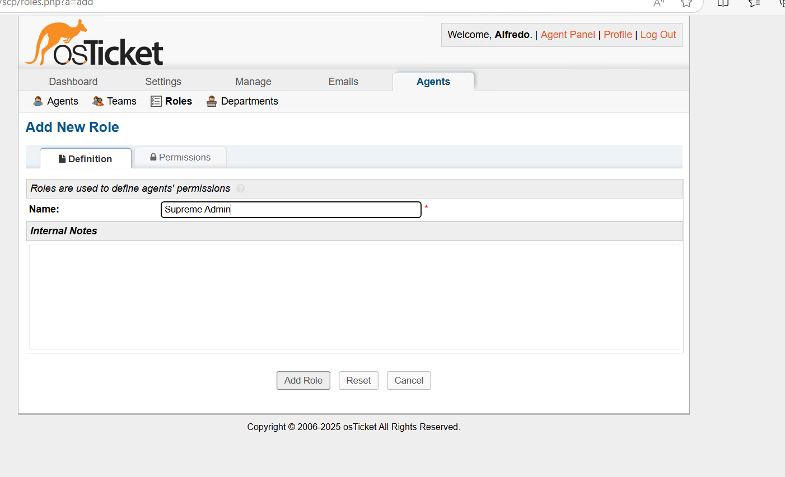
  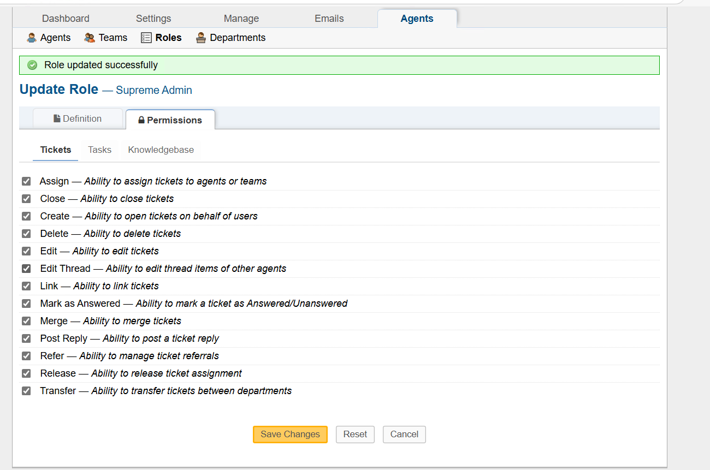
  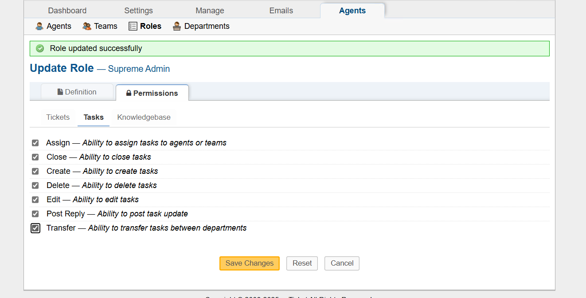
  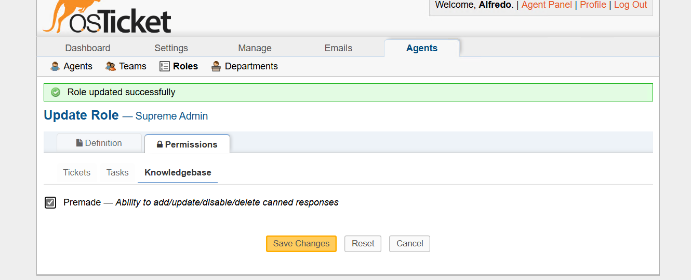

 
 
<h3 align="center">Configure Departments</h3>
 

  Admin Panel -> Agents -> Departments.

  System Administrators:

  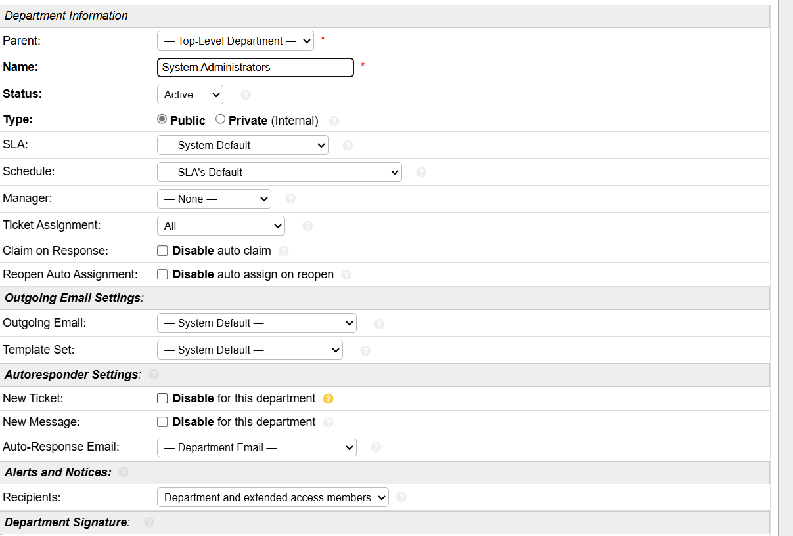

 
 
<h3 align="center">Configure Teams</h3>
 

  Admin Panel -> Agents -> Teams.

  Level II Support:

  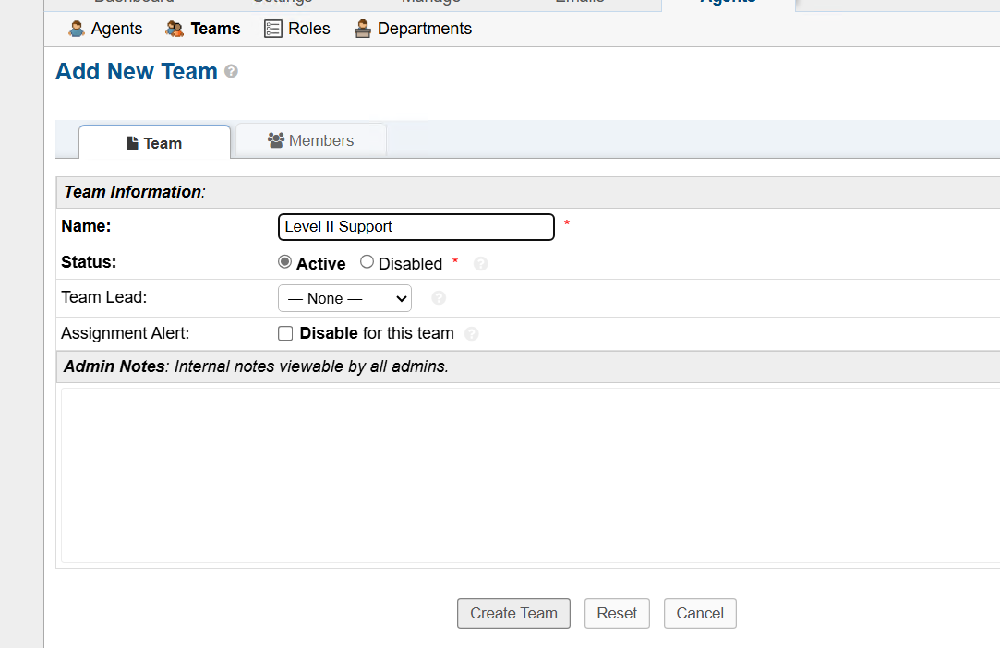STOPPED HERE

 
 
<h3 align="center">Allow anyone to create ticket</h3>
 

  Admin Panel -> Settings -> User Settings.

  Make sure "Require registration and login to create tickets" is not selected:

  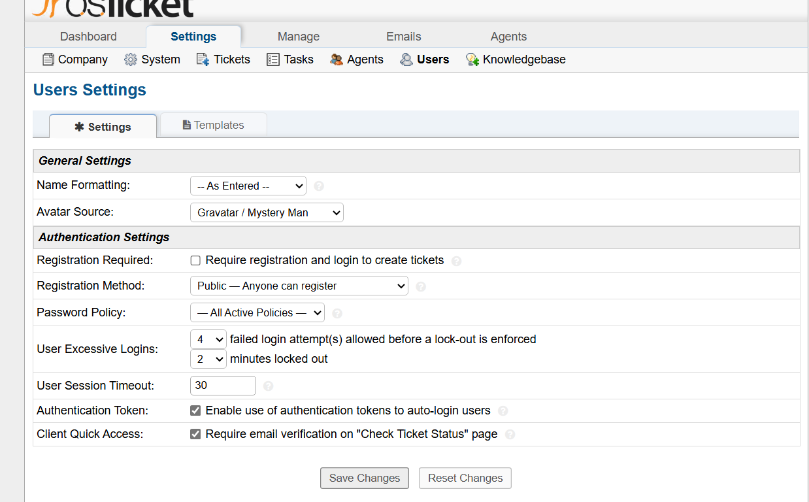

 
 
<h3 align="center">Configure Agents (workers)</h3>
 

  Admin Panel -> Agents -> Add New.

  Jon Doe:

  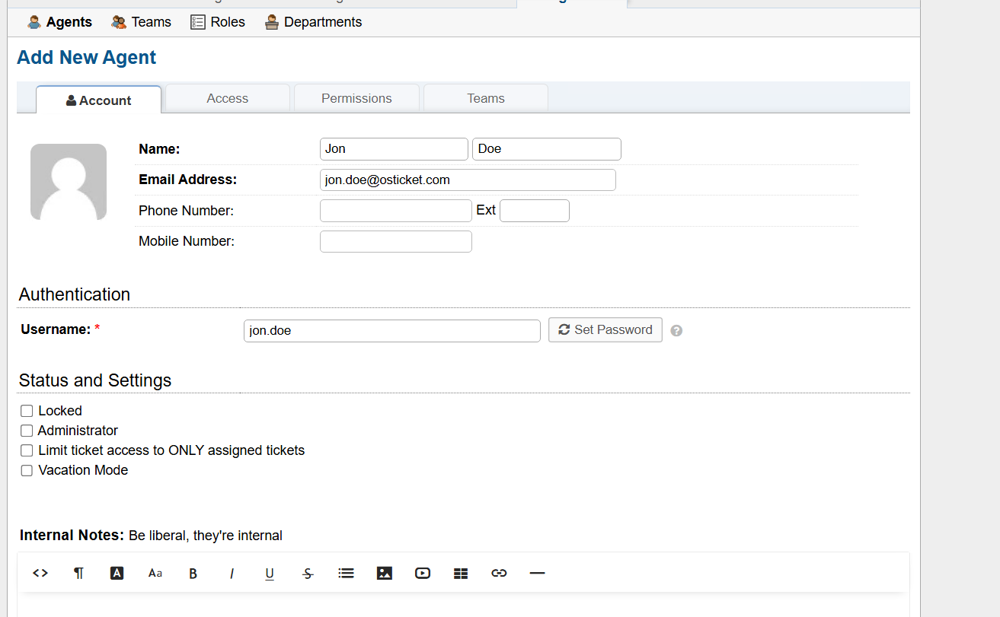
  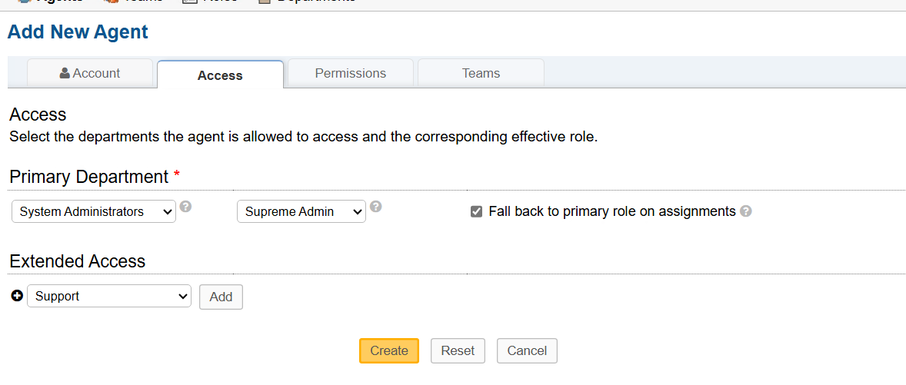

  Do the same with Jane Doe:
  
<h3 align="center">Configure Users (customers)</h3>
 

  Admin Panel -> Users -> Add New.

  Ken User:

  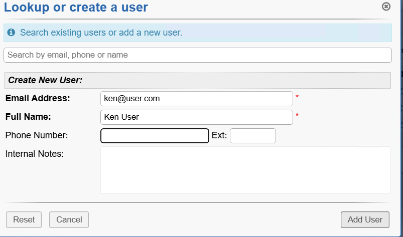

  Repeat the same above for Karen User.

 
 
<h3 align="center">Configure SLA</h3>
 

  Admin Panel -> Manage -> SLA.

  Sev-A (1 hour, 24/7).

  Sev-B (4 hours, 24/7).

  Sev-C (8 hours, business hours):

  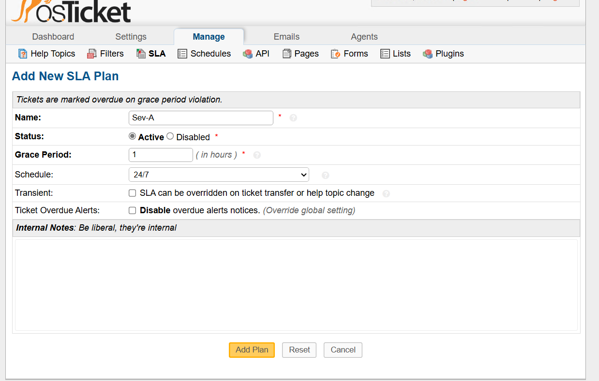
  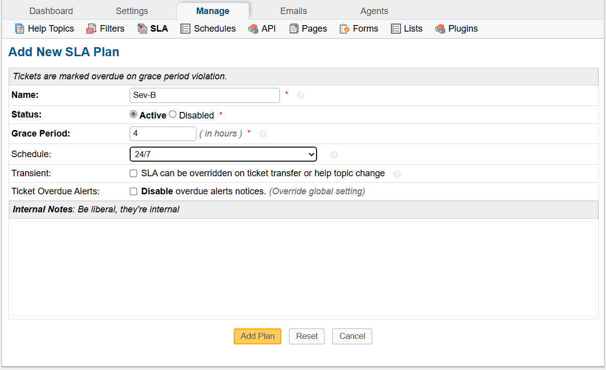
  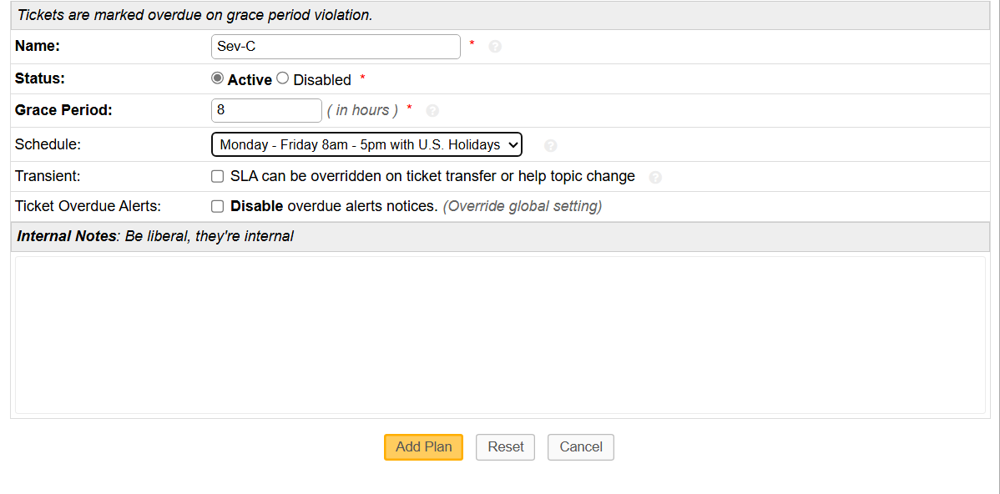

 
 
<h3 align="center">Configure Help Topics</h3>
 

  Admin Panel -> Manage -> Help Topics.

  Business Critical Outage.

  Personal Computer Issues.

  Equipment Request.

  Password Reset.

  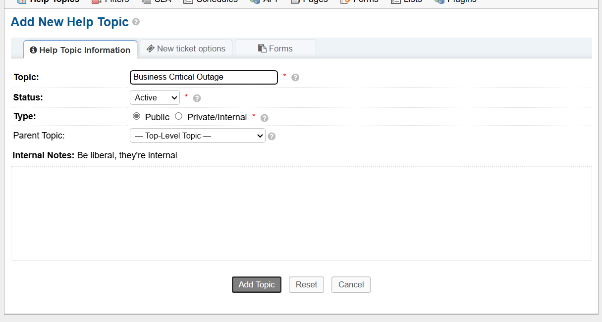
  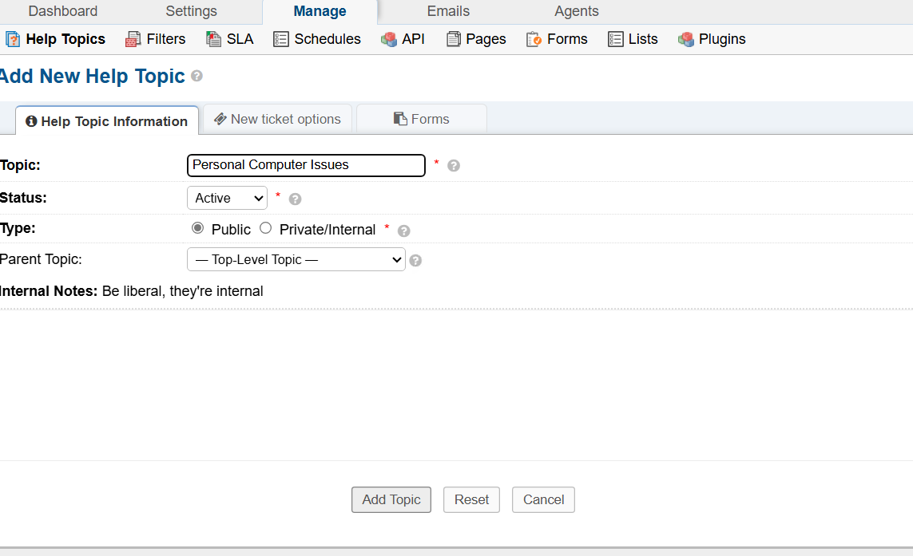
  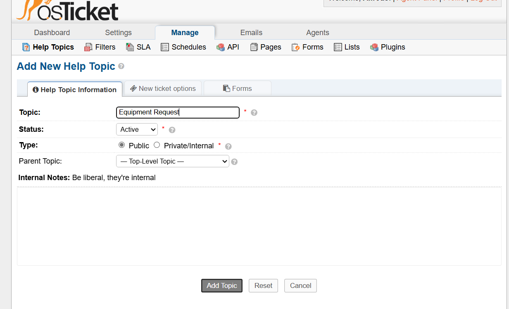
  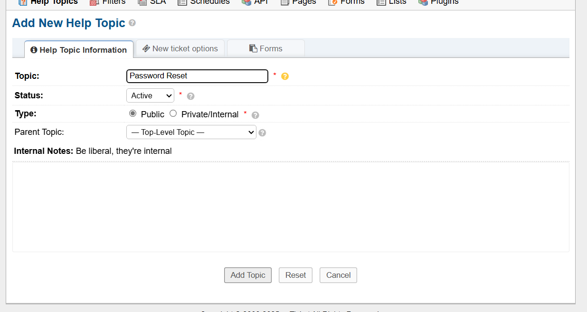

 
 

  This now fully configures our osTicket. I hope this guide was able to help clarify and assist you in setting up your osTicket. It is recommended to practice triaging and solving tickets.

  This is a very important skill to have for any help desk specialist, as they are the first line of communication between a company and it's customers when it comes to handling issues regarding a product or service they provide.

